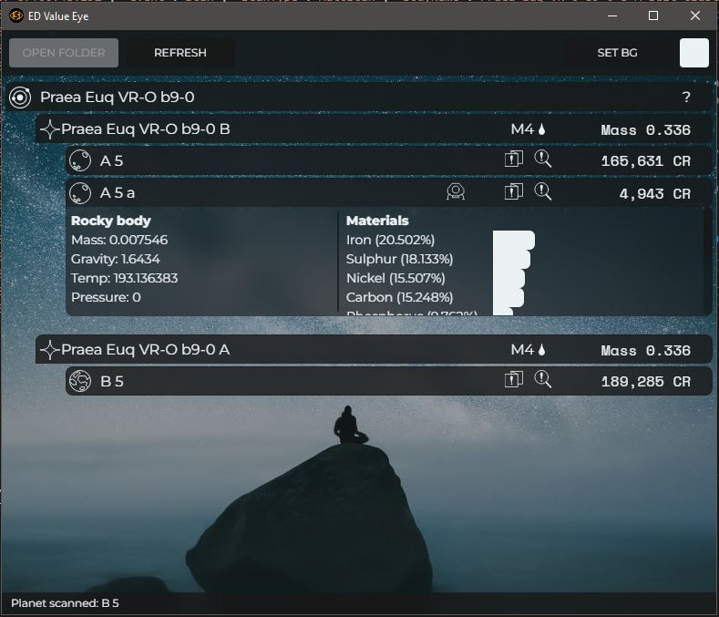

<p align="center"> 
  
</p>

<h1 align="center">ED-ValueEye</h1>

<p align="center">
    <b>Version 0.1</b><br/>
    <br/>
    Created by:<br/>
    Ethan Scully
</p>

***

### Why Make Another Elite Dangerous Exploration Tool?

It's true, there are many competant and sophisticated programs already in use by Elite Dangerous players. However, I struggled to find one that matched what I was looking for in an exploration companion app: Simple setup, clean and attractive interface, low overhead, and provides of the information I was looking for, no more, no less.

***

### Description

<p align="center"> 
  
</p>

**ED ValueEye** is a desktop application created with Electron and Svelte that reads the users log file to present system information. It currently displays a collapsable hierarchy of stars and planets, along with information for each planet.

The information provided is deliberate, mostly providing a shorthand for the value and resources for each planetary body. I've worked to balance the interface to provide enough to assist the player with making informed decisions about which planet to focus on (especially regarding whether or not a planet is terraformable), but withholding enough to make exploration still feel like an adventure.

***

### Usage

ED ValueEye is still in the alpha stage and has some bugs that need to be resolved. so I've held off on creating a release exe. If you'd like to try it out (or help me bug test), you can compile the program yourself with the files in this Github repo.

Simply download the repo, install any dependencies, and run the app, like so:

```
$ npm install
$ npm run dev
```

Once the program is running, click the 'open folder' button and navigate to the folder containing your Elite Dangerous log files. These are typically found here:

```
C:/Users/(USERNAME)/Saved Games/Frontier Developments/Elite Dangerous
```

Once you've located the correct folder, ED ValueEye will save the location, so you should only have to set it once.

***

### Known Issues

Release 0.1 is the first alpha. While the program is fairly stable, it still has some issues correctly reading stars, therefore some planets will show up under 'unknown stars.' I expect to patch this problem soon.

***

### Cheers!

